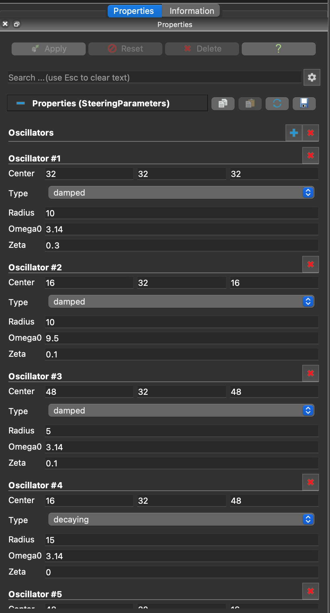
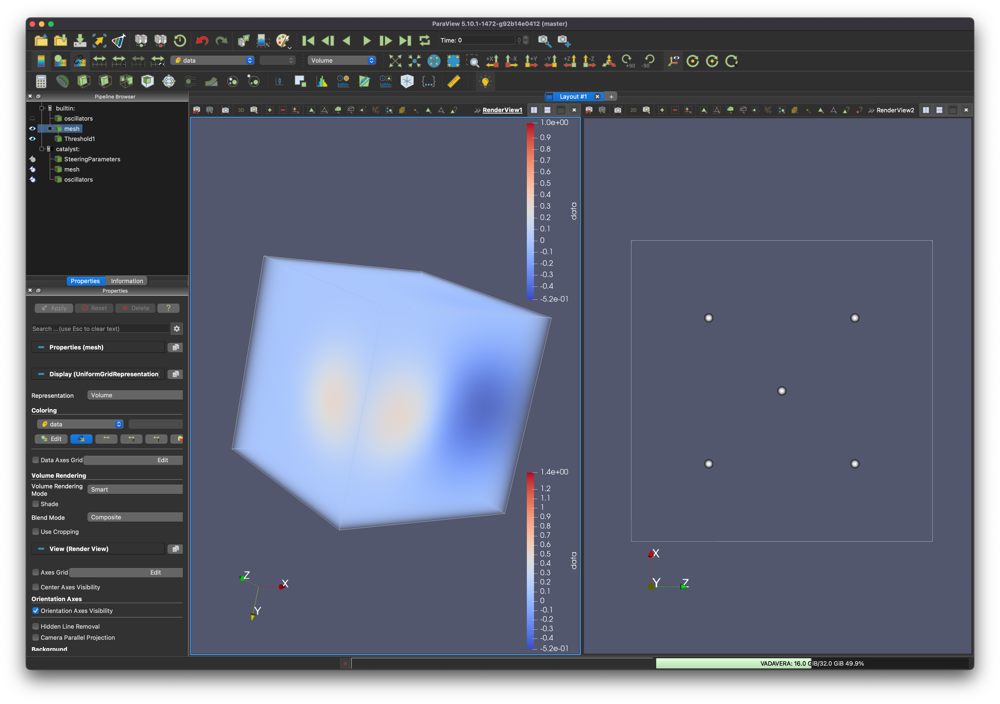

.. _catalyst_bidirectional:
***********************************************
Computational Steering with Catalyst and SENSEI
***********************************************

Getting Started
###############

You will need ParaView 5.10 installed, and SENSEI compiled with the options `ENABLE_CATALYST` and `ENABLE_CATALYST_PYTHON` turned on.

Open the ParaView application and navigate to `Tools`->`Manage Plugins`. Press the `Load New...` button, and navigate the file browser to the location of the `oscillator_catalyst_steering_proxies.xml` file, and select that file.

Next, navigate to `Catalyst`->`Connect` and accept incoming connections on port 22222. This will tell ParaView to begin listening for Catalyst connections on that port. If a different port number is desired, you will need to edit the port number in the Catalyst python script `oscillator_catalyst_steering.py` to the desired port, and then start Catalyst in ParaView with the same desired port number.

In a terminal, navigate to your desired run directory (this testing directory is fine to run from), and start the oscillator miniapp with the SENSEI config xml `oscillator_catalyst_steering.xml`. Oscillator miniapp options can be set as desired, but a good starting point is:

.. highlight:: shell

::

mpirun -np 1 /path/to/oscillator -g 1 -t 0.01 -f oscillator_catalyst_steering.xml simple.osc

With the Oscillator miniapp running, ParaView should automatically detect a new Catalyst connection and add several items to the catalsyt server list in the `Pipeline Browser`. Clicking the icon next to `mesh` and `oscillator` will display the data to the 3D viewport, updating as the miniapp progresses.

Click on the `Steering Parameters` item in the `Pipeline Browser`. The `Properties` panel will display several controls over each oscillator which can be modified, manipulating the oscillator parameters as the miniapp executes.

   The Properties panel provides parameters to add or delete oscillators in the domain, and change the parameters of the oscillators independently.

   ParaView's GUI contains the Properties panel, where oscillator parameters can be edited, a center 3D Viewport where the oscillators are rendered using ray-traced volume rendering, and a second 3D Viewport where the 5 existing oscillators' locations are visualized with respect to one another.
