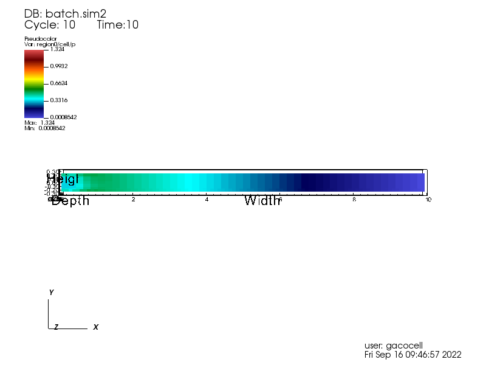

SENSEI OpenFOAM Interface
=========================

Synopsis
########

The SENSEI OpenFOAM Interface integrates SENSEI into OpenFOAM.  The interface
is implemented as an OpenFOAM function object which subclasses the SENSEI
VTKDataAdaptor.  The interface was developed using Version 7 of OpenFOAM at
`openfoam.org <https://openfoam.org/>`_ and SENSEI 3.2.1.  This interface may
work with other OpenFOAM and SENSEI versions, but this has not been tested.

Setting Up
##########

These instructions assume that SENSEI and OpenFOAM have already been built and
installed.

To build the OpenFOAM function object that implements the SENSEI interface,
edit the file functionObjects/sensei/Allwmake and specify paths to SENSEI and
to VTK by setting the following variables:

.. code-block:: shell

    SENSEI_DIR="SENSEI installation path"
    VTK_INC="path to VTK include files"
    VTK_LIB="path to VTK libraries"

Note that you must point the the same VTK version used by SENSEI.

These paths will be used to set the compile and link flags used by the build
as follows.  These typically will not need to be modified:

.. code-block:: shell

    export SENSEI_CXXFLAGS="-O2 -I$SENSEI_DIR/include -I$VTK_INC"
    export SENSEI_CXXLIBS="-L$SENSEI_DIR/lib -lsensei -lsenseiCore -lpugixml"
    export SENSEI_CXXLIBS="$SENSEI_CXXLIBS -Wl,-rpath=$VTK_LIB"

To build the interface, you set up your OpenFOAM environment and execute the
Allwmake script:

.. code-block:: shell

    cd functionObjects/sensei
    source "OpenFOAM installation path"/etc/bashrc
    ./Allwmake

Running Allwmake builds the interface and installs it into the users OpenFOAM
library directory.

Running the Example
###################

Copy the pipeCyclic tutorial from the OpenFOAM distribution to use as an
example.  You can find it here:

.. code-block:: shell

    "OpenFOAM installation path"/tutorials/incompressible/simpleFoam/pipeCyclic

Edit the system/controlDict file in the tutorial and add a
senseiFunctionObject block into the functions section.  This will load the
interface during the solver run and export the requested fields.  For example:

.. code-block:: javascript

    functions
    {
        senseiFunctionObject
        {
            type        senseiFunctionObject;
            libs        ("libSenseiAdaptor.so");

            enabled     true;

            name        simpleFoam;
            desc        "simpleFoam pipeCyclic tutorial SENSEI export";
            fields	    ( U p k epsilon );
        }
    }

Next, create a file called constants/sensei_config.xml to control what SENSEI
will export.  Here is an example sensei_config.xml file that outputs PNG
images of a slice using Libsim"

.. code-block:: xml

    <sensei>
        <analysis type="libsim"
            plots="Pseudocolor"
            plotvars="region0/cell/p"
            slice-origin="0,0,0.25" slice-normal="1,1,1"
            image-filename="openfoam_slice_%ts"
            image-width="800" image-height="600"
            image-format="png"
            frequency="1"
            enabled="1" />
    </sensei>

Then run the tutorial using the Allrun script:

.. code-block:: shell

    ./Allrun

Results
#######

Here are two of the images produced running the tutorial with the above
sensei_config.xml file:

.. figure:: images/openfoam_slice_00001.png

    Z = 0.25 slice at time step 1

    Z = 0.25 slice at time step 10
