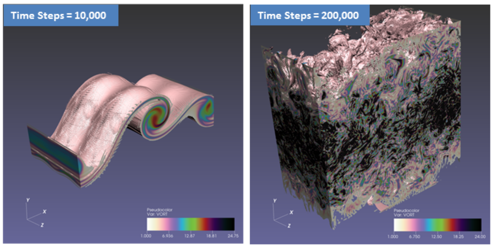
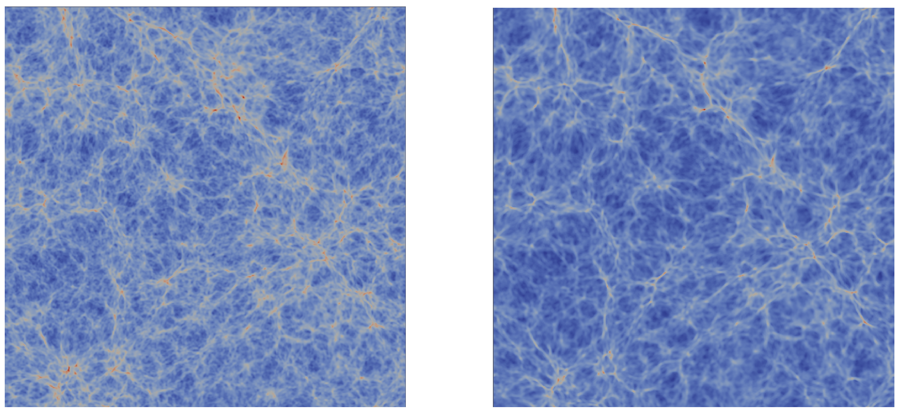
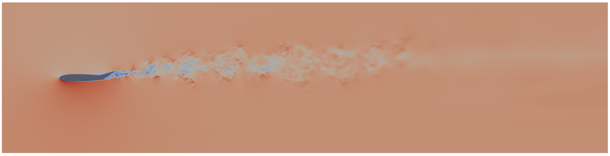

.. _Ayachit_SC16:
***********************************************
SENSEI SC16 Paper
***********************************************

Title
########

Performance Analysis, Design Considerations, and Applications of
Extreme-scale In Situ Infrastructures

Authors
########

Utkarsh Ayachit, Andrew Bauer, Earl P. N. Duque, Greg Eisenhauer,
Nicola Ferrier, Junmin Gu, Kenneth E. Jansen, Burlen Loring,
Zarija Lukic , Suresh Menon, Dmitriy Morozov, Patrick O’Leary,
Reetesh Ranjan, Michel Rasquin, Christopher P. Stone,
Venkat Vishwanath, Gunther H. Weber, Brad Whitlock, Matthew Wolf,
K. John Wu, and E. Wes Bethel

Abstract
########
A key trend facing extreme-scale computational science is the widening
gap between computational and I/O rates, and the challenge that
follows is how to best gain insight from simulation data when it is
increasingly impractical to save it to persistent storage for
subsequent visual exploration and analysis. One approach to this
challenge is centered around the idea of in situ processing, where
visualization and analysis processing is performed while data is still
resident in memory. This paper examines several key design and
performance issues related to the idea of in situ processing at
extreme scale on modern platforms: scalability, overhead, performance
measurement and analysis, comparison and contrast with a traditional
post hoc approach, and interfacing with simulation codes. We
illustrate these principles in practice with studies, conducted on
large-scale HPC platforms, that include a miniapplication and multiple
science application codes, one of which demonstrates in situ methods
in use at greater than 1M-way concurrency.

Mini-Application
^^^^^^^^^^^^^^^^

As a prototypical data source, we implemented a miniapplication, an
MPI code in C++, that simulates a collection of periodic, damped, or
decaying oscillators. Placed on a grid, each oscillator is convolved
with a Gaussian of a prescribed width. The oscillator parameters are
specified as the input, which is read and broadcast from the root
process. The user also specifies the time resolution, duration of the
simulation, and the dimensions of the grid, partitioned between the
processes using regular decomposition. The code iteratively fills the
grid cells with the sum of the convolved oscillator values; the
computation on each rank takes O(mN3) per time step, where m is the
number of oscillators and N3 is the size of the subgrid on the rank.
The computation is embarrassingly parallel; optionally, the ranks may
synchronize after every time step, but this synchronization is off in
the experiments below.

Pipelines
^^^^^^^^^

The miniapplication test configurations, listed below, show the
various combinations of the oscillator miniapplication, in situ the
ParaView/Catalyst, VisIt/Libsim, and ADIOS infrastructures, different
in situ analysis methods, and with/without use of the SENSEI data
interface.

+-----------------+------------------------------------------------------------------------------+
| Pipeline        | Description                                                                  |
+=================+==============================================================================+
| Original        | miniapplication with no SENSEI interface and no I/O. In some test            |
|                 | configurations, we do perform in situ analysis, but that coupling is done    |
|                 | directly via subroutine call and does not use any in situ interface. The     |
|                 | distinction of with vs. without analysis will be called out when needed in   |
|                 | the subsections that follow.                                                 |
+-----------------+------------------------------------------------------------------------------+
| Baseline        | miniapplication with SENSEI interface enabled, but no in situ analysis or    |
|                 | I/O. This configuration is useful in measuring the overhead of the SENSEI    |
|                 | data interface in isolation from other processing.                           |
+-----------------+------------------------------------------------------------------------------+
| Histogram       | miniapplication with the SENSEI interface enabled, and connected directly to |
|                 | an in situ histogram calculation, but without any of the in situ             |
|                 | infrastructures.                                                             |
+-----------------+------------------------------------------------------------------------------+
| Autocorrelation | miniapplication with the SENSEI interface enabled, and connected directly    |
|                 | to an in situ autocorrelation calculation, but without any of the in situ    |
|                 | infrastructures.                                                             |
+-----------------+------------------------------------------------------------------------------+
| Catalyst-slice  | miniapplication with SENSEI interface enabled, and connected to Catalyst,    |
|                 | which performs in situ rendering of a 2D slice from a 3D volume, then writes |
|                 | the image to disk.                                                           |
+-----------------+------------------------------------------------------------------------------+
| Libsim-slice    | miniapplication with SENSEI interface enabled, and connected to Libsim, which|
|                 | performs in situ rendering of a 2D slice from a 3D volume, then writes the   |
|                 | image to disk.                                                               |
+-----------------+------------------------------------------------------------------------------+
| ADIOS-FlexPath  | miniapplication with SENSEI interface en- abled, and connected to the ADIOS  |
|                 | FlexPath in situ infrastructure. Within this miniapplication/in situ         |
|                 | infrastructure combination, we further refine the configuration in §§4.1.4 to|
|                 | include in situ workloads for histogram, autocorrelation, and Catalyst-slice.|
+-----------------+------------------------------------------------------------------------------+

Science Application Examples
############################

   Computational Fluid Dynamics - The Evolution of Temporal Mixing Layer from Initial to Vortex Breakdown using AVF-LESLIE.

   Computational Cosmology - Time steps 200 and 300 of the 10243 Nyx Lyman α forest simulation. Simulations often only save every 100th time step. The difference between these time steps is considerable, hampering feature tracking.

   Computational Fluid Dynamics - 6.33 Billion element grid with 1,048,576 MPI ranks on 32,768 nodes (32 MPI ranks per node) with output size of 2900x725 and 30 time steps.

#######
