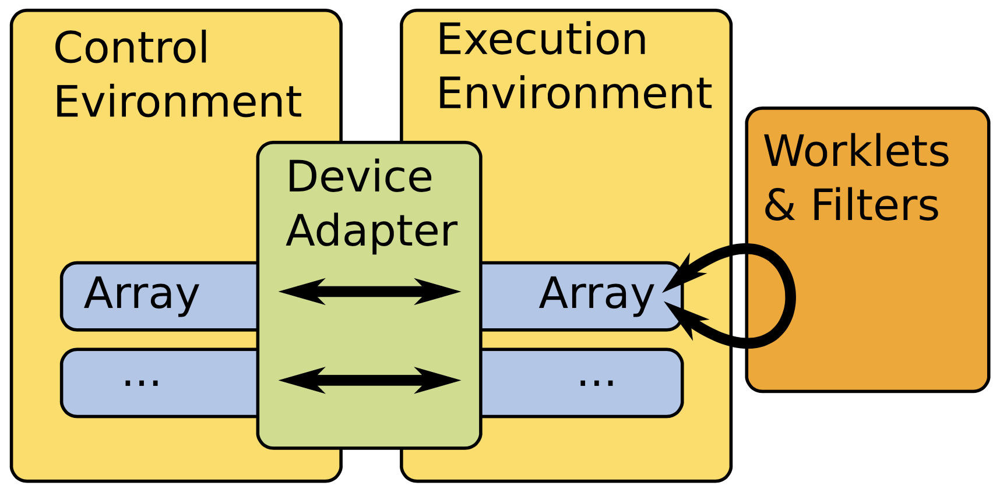
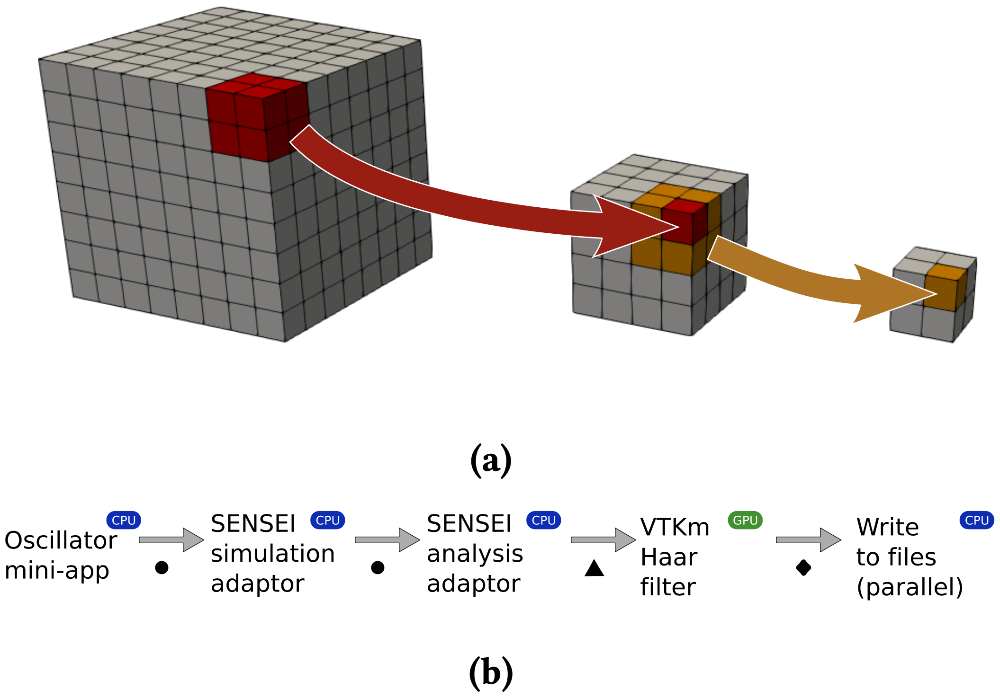
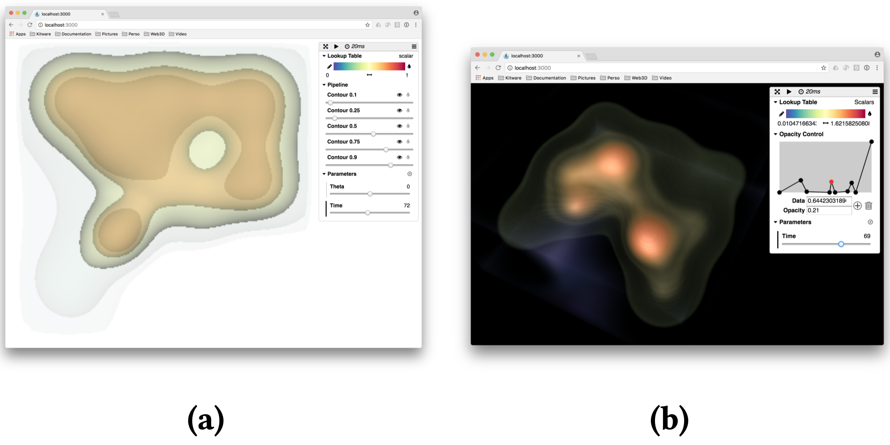
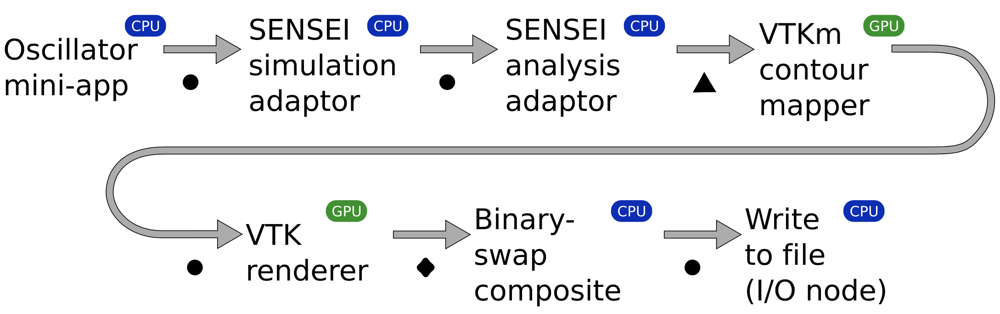

.. _ThompsonISAV17

***********************************************
SENSEI ISAV17 Paper
***********************************************

Title
########

In Situ Summarization with VTK-m

Authors
########

David Thompson, Sebastien Jourdain, Andrew Bauer, Berk Geveci,
Robert Maynard, Ranga Raju Vatsavai, and Patrick O’Leary

Abstract
########
Summarization and compression at current and future scales requires a
framework for developing and benchmarking algorithms. We present a
framework created by integrating existing, production- ready projects
and provide timings of two particular algorithms that serve as
exemplars for summarization: a wavelet-based data reduction filter and
a generator for creating image-like databases of extracted features
(isocontours in this case). Both support browser-based, post-hoc,
interactive visualization of the summary for decision- making. A study
of their weak-scaling on a distributed multi-GPU system is included.

VTK-m
^^^^^

   VTKm’s architecture lazily transfers arrays to streaming processors for analysis.

Summarization Examples
############################

   Data Reduction - (a) By running a Haar wavelet filter multiple times, we can reduce the volume to a fixed size that is appropri- ate for rendering in a browser via ArcticViewer (depicted in Figure 5b). (b) Our wavelet-based reduction pipeline uses VTKm to compute multiple passes of the DHW transform. Circular dots indicate a zero-copy handoff of data. The tri- angle and diamond indicate where VTKm and VTK transfer data to/from the GPU, respectively.

   Isocontours - Complex periodic system composed of a grid of nine big oscillators and four interleaved smaller ones with various frequencies. Visualizations via (a) translucent contours and (b) in-browser volume rendering.

   Isocontours - Our visual summary rendering pipeline uses VTKm to compute renderings of isocontours. Circular dots indicate a zero-copy handoff of data. The triangle and dia- mond indicate where VTKm and VTK transfer data to/from the GPU, respectively.
#######
