.. _vignettes:

**********************************
Analysis & Visualization Vignettes
**********************************

======
Papers
======

..
   add an image with a tag like the below references to add more vignettes. add
   the image to the grid below. you can link to you page using the :target:
   keyword make sure your preview image for this page is 600x600px. Deviating
   from those dimensions will cause issues when rendering the page.

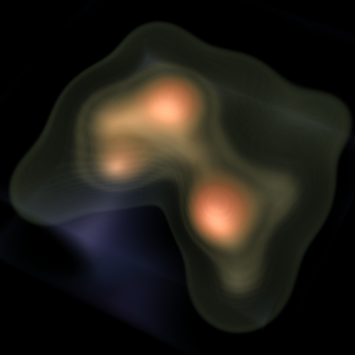

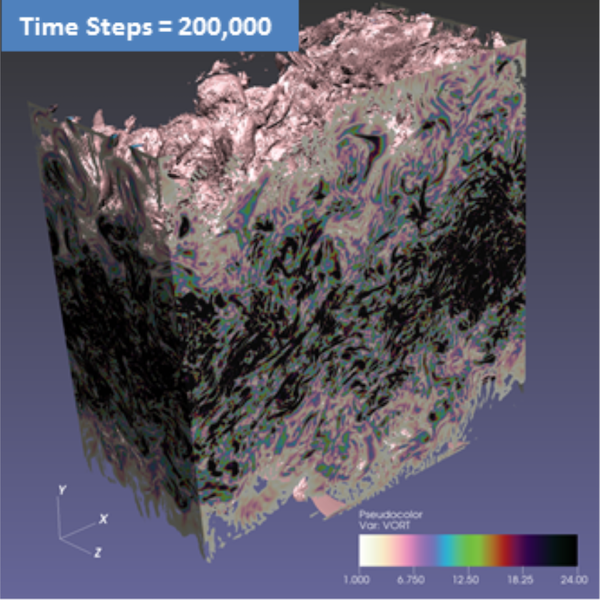

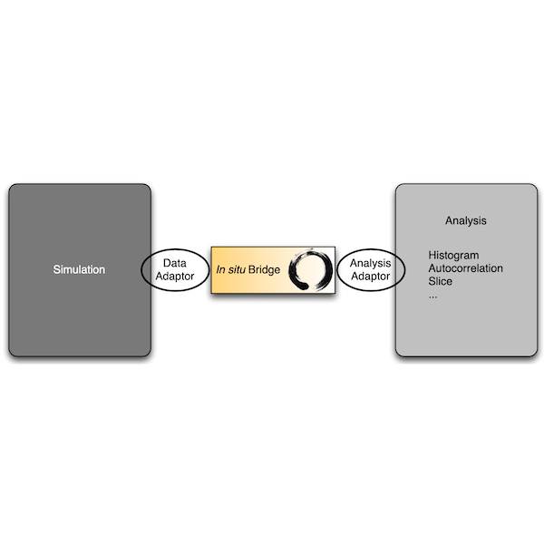

.. |EWC22| image:: images/engwcmp_preview.png
   :width: 600px
   :target: paper-newberry-ewc22.html

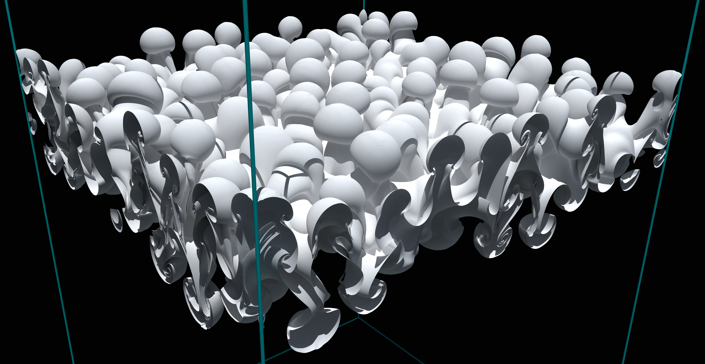

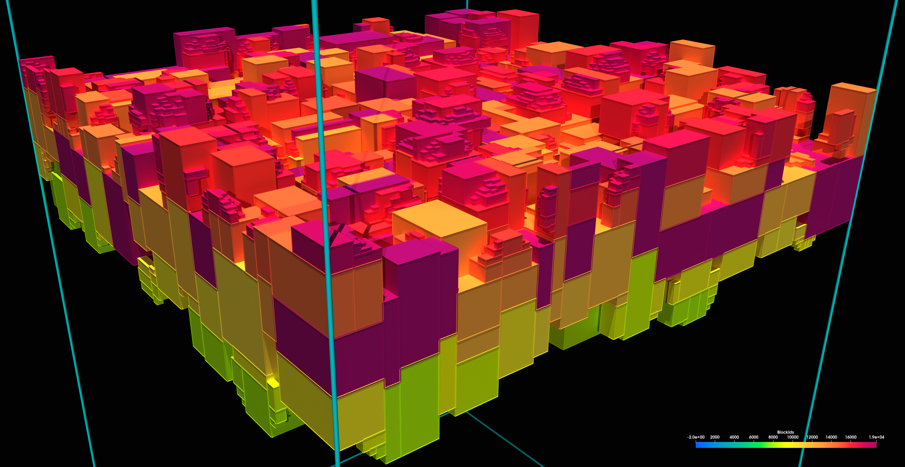

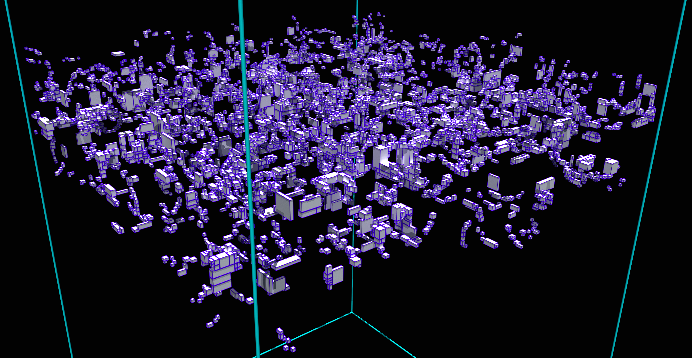

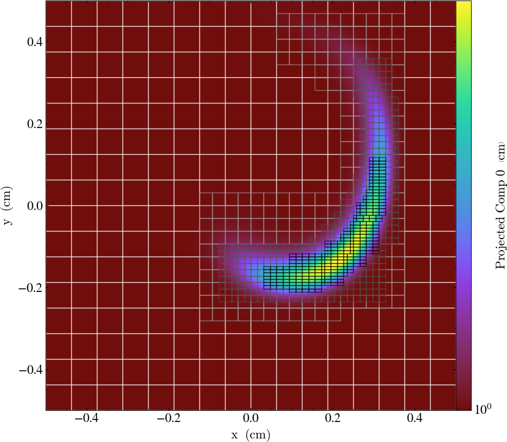

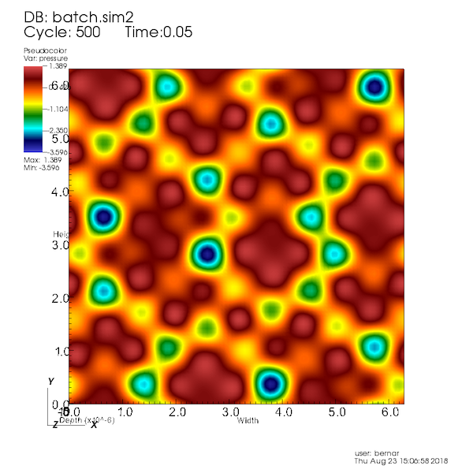

.. |wuISAV18| image:: images/libis.png
   :width: 600px
   :target: paper-usher-isav18.html

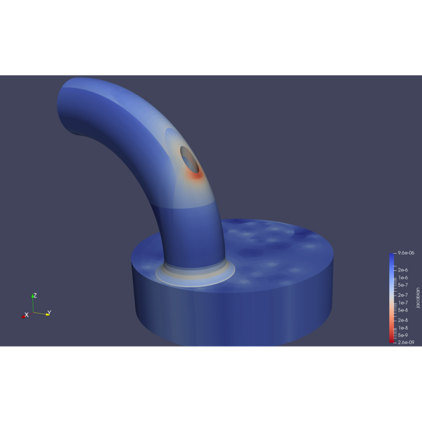

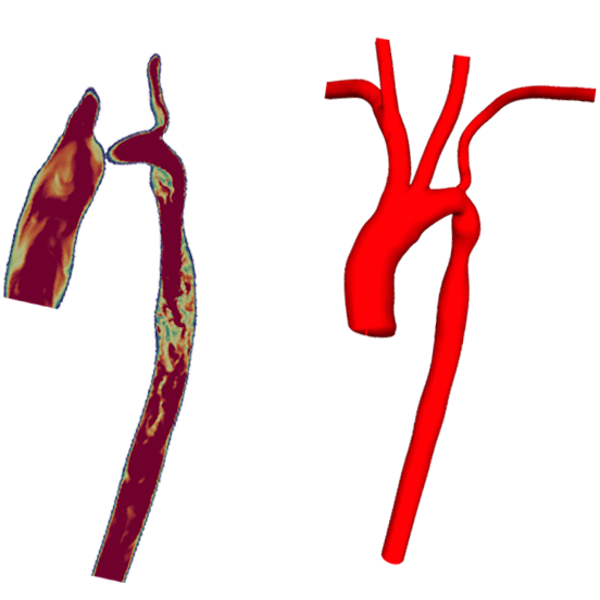

+------------------+-----------------+
| |EWC22|          | |blEGPGV20iso|  |
|                  | |blEGPGV20bu|   |
|                  | |blEGPGV20bn|   |
+------------------+-----------------+
| |ssEGPGV19|      | |jaLDAV19|      |
+------------------+-----------------+
| |blISAV18|       | |bbLDAV18|      |
+------------------+-----------------+
| |wuISAV18|       | |ISAV17|        |
+------------------+-----------------+
| |SC016|          | |ISAV16|        |
+------------------+-----------------+

.. toctree::
   :maxdepth: 1
   :name: vignettes_papers
   :numbered:

   paper-newberry-ewc22
   paper-loring-egpgv20
   paper-shudler-egpgv19
   paper-ames-ldav19
   paper-loring-isav18
   poster-bernardoni-ldav18
   paper-usher-isav18
   paper-thompson-isav17
   paper-ayachit-sc16
   paper-ayachit-isav16

======================
Tutorials and Examples
======================

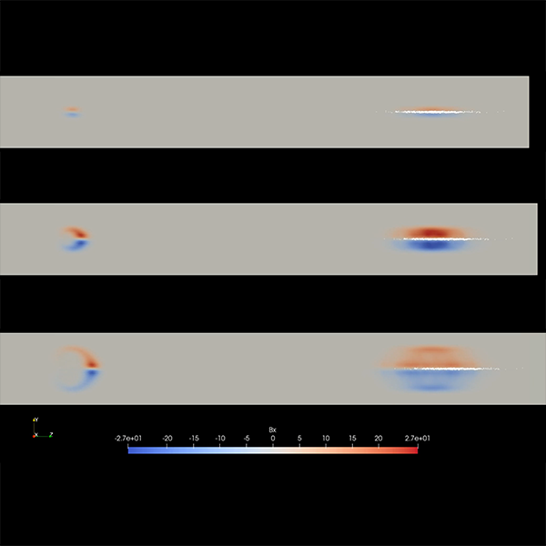

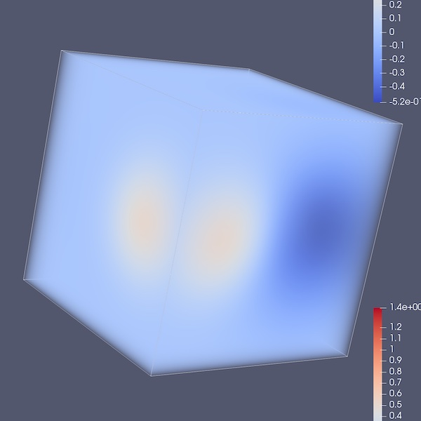

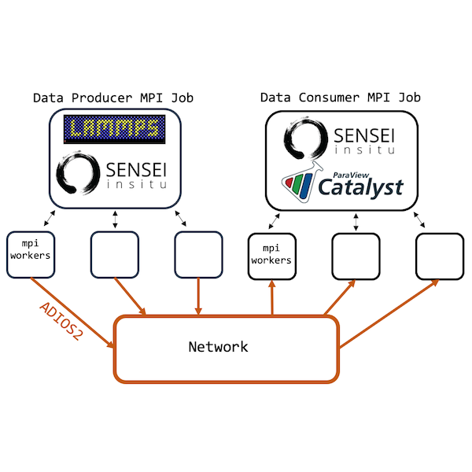

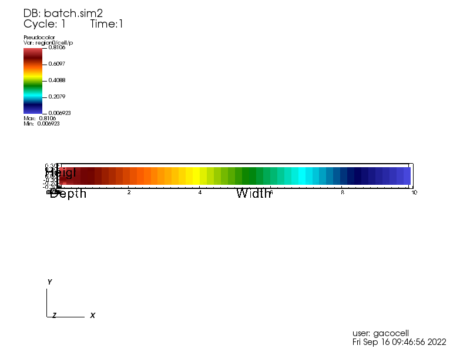

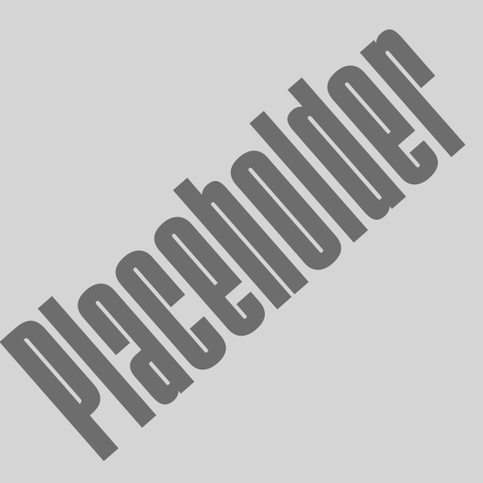

+--------------+-------------+
||amrex-ex|    ||catalyst-ex||
+--------------+-------------+
||intransit-ex|||openfoam-ex||
+--------------+-------------+

.. toctree::
   :maxdepth: 1

   examples_amrex_tutorials
   examples_catalyst_bidirectional
   examples_intransit
   examples_openfoam

