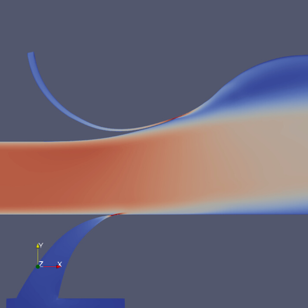

.. _vignettes:
**********************************
Analysis & Visualization Vignettes
**********************************

Papers
------
..
   add an image with a tag like the below references to add more vignettes. add the image to the grid below. you can link to you page using the :target: keyword make sure your preview image for this page is 600x600px. Deviating from those dimensions will cause issues when rendering the page.

.. |SC016| image:: images/v_vortex_breakdown_preview.png
   :width: 100%
   :target: paper-ayachit-sc16.rst

.. |ISAV16| image:: images/SENSEI-design_preview.png
   :width: 100%
   :target: paper-ayachit-isav16.rst

+--------+-------+
||ISAV17|||SC016||
+--------+-------+
||ISAV16|||EWC22||
+--------+-------+

Tutorials and Examples
----------------------

.. |amrex-ex| image:: images/amrex_tutorial_preview.png
   :width: 100%
   :target: examples_amrex_tutorials.rst
   
.. |catalyst-ex| image:: images/pv_catalyst_steering_preview.png
   :width: 100%
   :target: examples_catalyst_bidirectional.rst

.. |pipeline-x| image:: images/placeholder.png
   :width: 100%
   :target: pipeline_demo.rst

.. |example-ex| image:: images/placeholder.png
   :width: 100%
   :target: examples_example_rst.rst

+-------------+-------------+--------------+
||amrex-ex|   ||catalyst-ex|||example-ex|  |
+-------------+-------------+--------------+
||pipeline-x| ||example-ex| ||example-ex|  |
+-------------+-------------+--------------+
